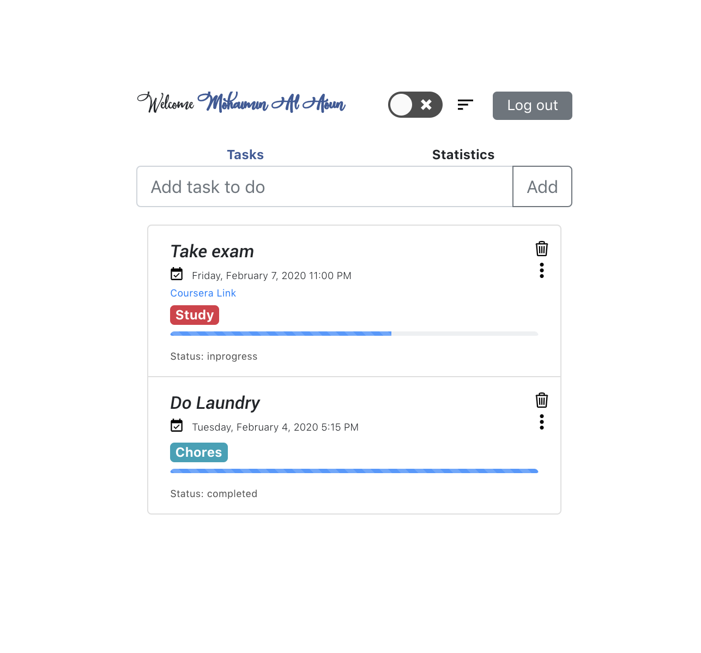

# Planner App
An offline tasks app for taking notes and making lists.

A meter based planning app that allows you to create plans, add details with rich text formatting (including code!), add labels to caterogize them, add deadlines for the plans, and add hyperlinks to the plans. Complete with visualizations about your plans to keep you motivated and interested in your plans.

Check it out! 	[Planner App](https://mohaiminalaoun.github.io/Planner-App)

This project was bootstrapped with [Create React App](https://github.com/facebook/create-react-app).
